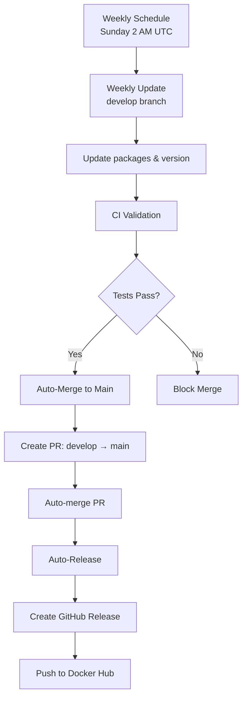

# DockyDEB CI/CD Workflows

This directory contains the GitHub Actions workflows for the DockyDEB project following a **develop → main** release pattern.

## Workflow Architecture



## Workflows

### 1. Weekly Update (`weekly-update.yaml`)

**Purpose**: Updates packages and versions on the `develop` branch weekly.

**Triggers**:

- **Scheduled**: Every Sunday at 2:00 AM UTC (develop branch only)
- **Manual**: Can be triggered manually via GitHub Actions UI

**What it does**:

1. **Version Management**: Automatically increments the patch version
2. **File Updates**: Updates `version.env` and `Dockerfile` labels
3. **Container Build**: Builds and tests the container image
4. **Commit Changes**: Commits version updates to develop branch

**Important**: This workflow does NOT push to Docker Hub or create releases.

### 2. Auto Merge to Main (`auto-merge-to-main.yaml`)

**Purpose**: Automatically merges validated changes from `develop` to `main`.

**Triggers**:

- **Push**: On pushes to `develop` branch
- **Pull Request**: On merged PRs to `develop` branch

**What it does**:

1. **CI Wait**: Waits for CI workflow to complete successfully
2. **Additional Validation**: Runs extra merge-specific tests
3. **Create PR**: Creates auto-merge PR from develop → main
4. **Auto-merge**: Enables auto-merge when all checks pass

### 3. Auto Release (`auto-release.yaml`)

**Purpose**: Creates GitHub releases and pushes Docker images from `main`.

**Triggers**:

- **Push**: On pushes to `main` branch (after merge from develop)
- **Manual**: Can be triggered manually with release type selection

**What it does**:

1. **Version Check**: Determines if a new release is needed
2. **Container Build**: Builds and tests the final container
3. **GitHub Release**: Creates tagged release with changelog
4. **Docker Push**: Pushes to Docker Hub with latest and versioned tags
5. **Multi-platform**: Builds for both `linux/amd64` and `linux/arm64`

### 4. Continuous Integration (`ci.yaml`)

**Purpose**: Validates the DockyDEB container on every push and pull request.

**Triggers**:

- **Push**: On pushes to `main` or `develop` branches
- **Pull Request**: On PRs to `main` or `develop` branches

**What it does**:

1. **Dockerfile Validation**: Checks syntax and structure
2. **Version Consistency**: Ensures version.env and Dockerfile labels match
3. **Container Build**: Builds the Docker image
4. **Functionality Tests**: Tests all included tools and utilities

**Test Coverage**:

- Command-line tools (curl, wget, git, etc.)
- Networking tools (ping, nslookup, etc.)
- System monitoring tools (htop, btop, etc.)
- Shell environment (zsh, Oh My Zsh)
- Custom configurations (welcome message, etc.)

## Branch Strategy

### Development Branch (`develop`)

- Weekly updates occur here
- All development and testing happens on this branch
- Must pass CI before merging to main

### Production Branch (`main`)

- Only receives changes via PR from develop
- Represents the stable, released state
- All releases and Docker pushes happen from this branch

## Usage

### Automatic Updates

The entire pipeline runs automatically:

1. **Sunday 2 AM UTC**: Weekly update runs on develop branch
2. **After update**: CI validates the changes
3. **If CI passes**: Auto-merge creates PR from develop → main
4. **After merge**: Auto-release creates GitHub release and pushes to Docker Hub

### Manual Operations

**Trigger Weekly Update**:

```bash
# Via GitHub CLI
gh workflow run weekly-update.yaml

# Or via GitHub UI: Actions → Weekly Update → Run workflow
```

**Manual Release**:

```bash
# Via GitHub CLI with release type
gh workflow run auto-release.yaml -f release_type=patch

# Available options: patch, minor, major
```

**Manual Develop → Main Merge**:
Create a PR from develop to main branch manually if needed.

### Version Management

**Automatic Versioning**:

- Weekly updates increment patch version (e.g., `v1.1.1` → `v1.1.2`)
- Changes are committed to develop branch first

**Manual Version Changes**:

- Edit `version.env` for major/minor version bumps
- Ensure Dockerfile labels match the version
- Changes should be made on develop branch

1. Create a branch with your changes
2. Push to the branch or open a PR
3. CI workflow will automatically validate the changes
4. Check the Actions tab for test results

## Workflow Status

You can monitor workflow status via:

- **GitHub Actions tab**: Real-time workflow execution
- **Pull Request checks**: CI status on PRs
- **Repository badges**: Status badges in README (if configured)
- **Docker Hub**: Automatic image updates

### Debugging

1. **Check workflow logs**: Go to Actions tab → Select failed workflow → View logs
2. **Test locally**: Build the container locally using the Makefile
3. **Validate changes**: Use the CI workflow to validate before merging

## Maintenance

### Regular Tasks

- Monitor workflow success rates
- Update base images when new Debian versions are available
- Review and update security scanning rules
- Check for deprecated GitHub Actions

### Updates Needed

- **GitHub Actions versions**: Keep actions up to date (e.g., `actions/checkout@v4`)
- **Docker base image**: Update Debian version in Dockerfile when needed
- **Tool versions**: Tools are updated automatically with the weekly builds

---

For more information about DockyDEB, see the main [README.md](../README.md) file.

&nbsp;

---

&nbsp;

Brought to you by the [Cloudresty](https://cloudresty.com) team.

[Website](https://cloudresty.com) &nbsp;|&nbsp; [LinkedIn](https://www.linkedin.com/company/cloudresty) &nbsp;|&nbsp; [BlueSky](https://bsky.app/profile/cloudresty.com) &nbsp;|&nbsp; [GitHub](https://github.com/cloudresty) &nbsp;|&nbsp; [Docker Hub](https://hub.docker.com/u/cloudresty)

&nbsp;
