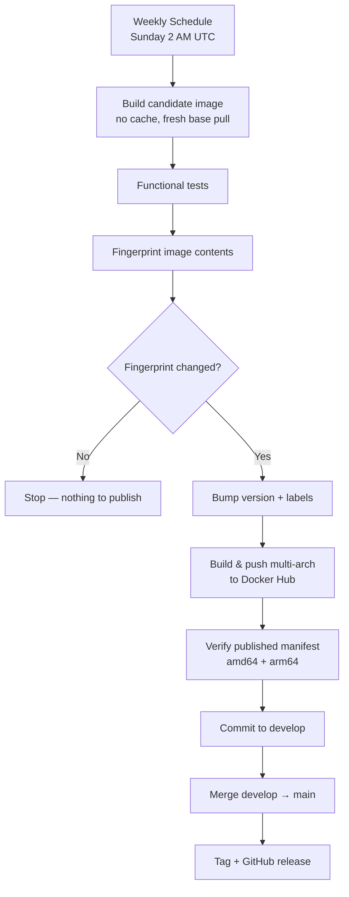

# DockyDEB CI/CD Workflows

This directory contains the GitHub Actions workflows for the DockyDEB project.

DockyDEB is a debugging container whose value is being current, so the release
pipeline is built around one question: **does a freshly built image differ from
the one already published?** If it does, a new version ships. If it does not,
nothing happens.

## Workflow Architecture


```mermaid
graph TD
    A[Weekly Schedule<br/>Sunday 2 AM UTC] --> B[Build candidate image<br/>no cache, fresh base pull]
    B --> C[Functional tests]
    C --> D[Fingerprint image contents]
    D --> E{Fingerprint changed?}
    E -->|No| F[Stop — nothing to publish]
    E -->|Yes| G[Bump version + labels]
    G --> H[Build & push multi-arch<br/>to Docker Hub]
    H --> I[Verify published manifest<br/>amd64 + arm64]
    I --> J[Commit to develop]
    J --> K[Merge develop → main]
    K --> L[Tag + GitHub release]
```

Everything above happens in **a single workflow run**. This is deliberate — see
[Why one workflow](#why-one-workflow).

## Workflows

### 1. Weekly Update (`weekly-update.yaml`)

**Purpose**: Rebuild the container weekly and publish a new version only when
its contents actually changed.

**Triggers**:

- **Scheduled**: Every Sunday at 02:00 UTC.
- **Manual**: `workflow_dispatch`, with optional `force_update` (publish even if
  unchanged) and `release_type` (`patch`, `minor` or `major`).

**What it does**:

1. Builds a candidate image with `no-cache` and a fresh base image pull, so the
   build genuinely resolves today's packages.
2. Runs functional tests against the candidate.
3. Computes a **content fingerprint** (see below) and compares it against the
   one recorded in `package-versions.json`.
4. If unchanged, stops. Nothing is committed, tagged or published.
5. If changed, bumps the version, updates the Dockerfile labels, and pushes a
   multi-arch image (`linux/amd64`, `linux/arm64`) to Docker Hub.
6. Verifies the published manifest contains both platforms and runs the
   published arm64 image under emulation.
7. Only then commits to `develop`, merges to `main`, tags, and creates the
   GitHub release.

The publish happens **before** any git mutation on purpose: if the Docker push
fails, nothing has been recorded, and the next run retries from a clean state.

### 2. CI (`ci.yaml`)

**Purpose**: Validate human changes.

**Triggers**: pushes and pull requests on `main` and `develop`.

Validates the Dockerfile, checks that `version.env` and the Dockerfile labels
agree, then builds and functionally tests the image.

## The Fingerprint

`scripts/image-fingerprint.sh` measures what is **actually inside a built
image** and reduces it to one `sha256`:

- the resolved digest of the base image named in the `FROM` line;
- every installed package and its exact version, read with `dpkg-query` — not
  just the packages named in the Dockerfile, so a security patch to a
  transitive dependency counts;
- the commit each vendored repository (Oh My Zsh, Powerlevel10k, the zsh
  plugins) was cloned at.

The result is stored in `package-versions.json` and compared on the next run.
`scripts/fingerprint-diff.sh` turns the difference between two manifests into
the bullet list used in the commit message and the release notes.

**Why measure the image rather than query apt?** Because a separate query can
drift away from the image it claims to describe. The previous implementation
did exactly that: it queried `debian:bookworm-slim` while the Dockerfile built
`debian:trixie-slim`, and its state file was written on a runner that was then
discarded — so every value stayed empty, every package looked new every week,
and the container was "updated" 27 times without a single image being published.
A measurement taken from the built artefact cannot drift.

## Why One Workflow

The pipeline used to be three workflows chained by push events: Weekly Update
pushed to `develop`, which was meant to trigger CI and Auto Merge, which was
meant to trigger Auto Release.

**That chain can never fire.** GitHub deliberately suppresses workflow triggers
for pushes made with the default `GITHUB_TOKEN`, to prevent infinite recursion.
Every hop after the first was dead, and because the first workflow only printed
what the next one *would* do, it reported success every week for six months
while publishing nothing.

The fix is not a stronger credential — it is not needing a second trigger.
A version bump does not require independent validation the way a code change
does, because the build and the tests already happen in the same run. So the
whole pipeline lives in one job and uses the built-in `GITHUB_TOKEN` with
`contents: write`. There is no App to install and no PAT to rotate or expire.

## Branch Strategy

### Development Branch (`develop`)

- Automated version bumps land here first.
- Human development and testing happens here.

### Production Branch (`main`)

- The released state, and the default branch.
- Brought up to date by the release workflow after a successful publish.
- **Scheduled workflows always run the copy of the workflow file on `main`**, so
  any change to `weekly-update.yaml` only takes effect once it reaches `main`.

## Usage

### Automatic Updates

Sunday 02:00 UTC, unattended. A run that publishes nothing is the expected
outcome on a quiet week and is not a failure.

### Manual Operations

**Trigger a check now**:

```bash
gh workflow run weekly-update.yaml
```

**Force a release even if nothing changed**:

```bash
gh workflow run weekly-update.yaml -f force_update=true
```

**Cut a minor or major version**:

```bash
gh workflow run weekly-update.yaml -f force_update=true -f release_type=minor
```

### Version Management

Versions are `vMAJOR.MINOR.PATCH` in `version.env`, mirrored into the
Dockerfile's `org.opencontainers.image.version` and `.revision` labels. The
workflow increments the patch by default and refuses to reuse a version that
already has a tag.

## Required Configuration

| Name | Kind | Purpose |
| :--- | :--- | :--- |
| `CLR__DOCKER_HUB_USERNAME` | Organisation variable | Docker Hub login |
| `CLR__DOCKER_HUB_PAT` | Organisation secret | Docker Hub push token |
| `GITHUB_TOKEN` | Built in | Commit, merge, tag, release |

`GITHUB_TOKEN` needs `contents: write`, which the workflow requests explicitly
and the repository already permits by default.

## Monitoring

A run's job summary states the decision, the fingerprint, and either the version
released or that nothing needed releasing. Because publishing happens in the
same job as the check, **a run that fails to publish fails the run** — the
failure mode that hid the previous outage is gone.

Worth a periodic glance: the latest GitHub release, the `latest` tag date on
[Docker Hub](https://hub.docker.com/r/cloudresty/dockydeb/tags), and that they
agree with `version.env`.

## Maintenance

- Keep the pinned action majors current (`actions/checkout`,
  `docker/*-action`).
- Update the Debian release in the Dockerfile's `FROM` line when appropriate —
  the fingerprint follows it automatically, no script change needed.
- Tool versions need no maintenance; they are whatever the weekly rebuild
  resolves.

---

For more information about DockyDEB, see the main [README.md](../../README.md) file.
